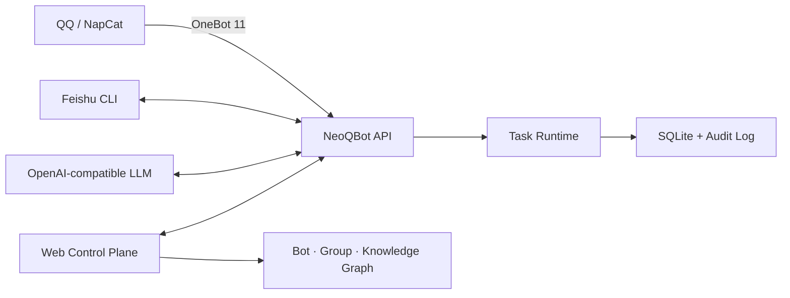

<div align="center">


# NeoQBot

**An auditable orchestration control plane for bots, groups, and knowledge resources**

[](https://www.python.org/)
[](LICENSE)
[](https://github.com/LYOfficial/NeoQBot)

[简体中文](README.md) · English · [日本語](README.ja.md)

[Quick start](#quick-start) · [Orchestration](#resource-orchestration) · [Deployment](#docker-deployment) · [Security](#security-boundaries) · [Documentation](#documentation)

</div>

NeoQBot is a self-hosted operations platform for bots and communities. It connects to QQ through
OneBot 11, integrates with Feishu through configurable CLI adapters, and represents bots, groups,
and knowledge bases as a visual, many-to-many resource graph.

The project began as tooling for a specific community and has evolved into a general-purpose
multi-platform control plane. Protocol adapters handle external systems, services implement
approval, recording, analysis, and synchronization workflows, and the web console provides
configuration, auditing, and orchestration.

> [!IMPORTANT]
> NeoQBot is conservative by default. Model output should be treated as operational evidence, not
> an irreversible decision. Review platform terms, account risk, and data-compliance requirements
> before connecting unofficial QQ clients or protocol implementations.

## Highlights

- **Visual resource graph** for QQ bots, Feishu bots, QQ groups, Feishu groups, and knowledge bases.
- **Many-to-many ownership** where one bot can manage several groups and several bots can cooperate
  on the same group.
- **Granular task controls** for join management, record-only ingestion, analysis, handling, and
  announcement synchronization.
- **Group workbench** for messages, announcements, join requests, moderation reports, and managers.
- **Auditable control plane** backed by SQLite records for jobs, configuration changes, login events,
  and conflicts.
- **Safe configuration updates** with secret masking, environment injection, optimistic revisions,
  and atomic writes.
- **Desktop-style interface** inspired by Windows 11, Codex, and VS Code, with dark/light themes and
  a command palette.
- **Replaceable adapters** for OneBot, Feishu CLI tools, and OpenAI-compatible model providers.

## Architecture



Platform-specific behavior remains behind adapter boundaries. Replacing an OneBot implementation,
a Feishu command-line client, or a model provider should normally require configuration or adapter
changes rather than workflow rewrites.

## Resource orchestration

The orchestration canvas supports five node types:

| Node | Purpose |
| --- | --- |
| QQ Bot | OneBot / NapCat account, QR login, and task configuration |
| Feishu Bot | CLI session, archiving, and search capabilities |
| QQ Group | Messages, announcements, reviews, analysis, and ownership |
| Feishu Group | Collaboration, notification, and knowledge-flow target |
| Knowledge Base | Policies, playbooks, answers, or external knowledge resources |

Edges use the relations `manages`, `observes`, `archives_to`, `searches`, and `syncs`. The graph is
the canonical source for QQ managed-group relationships and synchronizes effective bot settings when
saved. See the [orchestration guide](docs/ORCHESTRATION.md) for details.

## Quick start

### Requirements

- Python 3.11 or newer
- [uv](https://docs.astral.sh/uv/) is recommended
- Optional: Docker Compose, NapCatQQ, a Feishu CLI, and an OpenAI-compatible model endpoint

### Local installation

```bash
git clone https://github.com/LYOfficial/NeoQBot.git
cd NeoQBot
uv sync --extra dev
cp config.example.yaml config.yaml
uv run neoqbot --config config.yaml init-db
uv run neoqbot --config config.yaml serve
```

On Windows PowerShell:

```powershell
Copy-Item config.example.yaml config.yaml
uv run neoqbot --config config.yaml init-db
uv run neoqbot --config config.yaml serve
```

Open <http://127.0.0.1:8080/gui/>. The initial credentials are `admin` / `neoqbotadmin`; a password
change is required on first login.

## Docker deployment

```bash
cp .env.example .env
cp config.example.yaml config.yaml
docker compose build
docker compose up -d
docker compose logs -f neoqbot
```

The default host URL is `http://your-server:6688/gui/`. The Compose stack prepares persistent data,
NapCat configuration, QQ session state, QR-code cache, and the Feishu user directory. Production
deployments should restrict bind addresses and place the console behind an HTTPS reverse proxy.

Useful checks:

```bash
docker compose ps
docker compose exec neoqbot neoqbot --config /app/data/config.yaml doctor
curl http://127.0.0.1:6688/healthz
curl http://127.0.0.1:6688/readyz
```

## Configuration

Copy [config.example.yaml](config.example.yaml) to `config.yaml`. Environment variables use the
`NEOQBOT_` prefix and double underscores for nested fields:

```bash
NEOQBOT_APP__ADMIN_API_TOKEN=replace-with-a-long-random-token
NEOQBOT_LLM__API_KEY=replace-with-provider-key
```

Prefer environment variables or read-only secret files for credentials. Never commit real tokens,
cookies, QR codes, databases, or `config.yaml`. Store QQ and Feishu Bot credentials in each Bot's
read-only secret files. NeoQBot reads application configuration only from variables using the
`NEOQBOT_` prefix.

## CLI

```text
neoqbot --config config.yaml serve
neoqbot --config config.yaml init-db
neoqbot --config config.yaml doctor
neoqbot --config config.yaml show-config
neoqbot --config config.yaml run-moderation
neoqbot --config config.yaml sync-announcements
neoqbot --config config.yaml prune
neoqbot init-napcat
```

## Security boundaries

- Keep `app.dry_run: true` during initial integration testing.
- Use independent random tokens for the admin API, OneBot, and the NapCat WebUI.
- Expose the console through HTTPS and enable secure cookies in production.
- NeoQBot never stores QQ passwords; QR codes are produced by the associated NapCat instance.
- Roll out automatic approval, rejection, notification, and account actions to a minimal scope first.
- Protect and back up SQLite data, message archives, Feishu sessions, and NapCat session state.

## Repository layout

```text
src/neoqbot/                         NeoQBot Python package and CLI entry point
  adapters/                          QQ, Feishu, and LLM adapters
  web/                               Control-plane frontend
  app.py                             FastAPI application and management API
  config.py                          Configuration and orchestration models
  database.py                        SQLite persistence and audit layer
  services.py                        Join, moderation, and announcement workflows
  runtime.py                         Scheduling, queueing, and lifecycle
integrations/astrbot_plugin_neoqbot_control/
assets/branding/                      Logo source image, SVG, and brand notes
docs/                                Architecture and integration guides
```

The project name, Python package, distribution, CLI, service, and environment namespace are all NeoQBot.

## Development

```bash
uv sync --extra dev
uv run ruff check .
uv run ruff format --check src
node --check src/neoqbot/web/app.js
```

Changes should include relevant documentation. This repository intentionally ships without GitHub
Actions; maintainers should run the checks above in a controlled environment before merging.

## Documentation

- [Architecture and workflows](docs/ARCHITECTURE.md)
- [Resource orchestration](docs/ORCHESTRATION.md)
- [Feishu CLI integration](docs/FEISHU_CLI.md)
- [Brand assets](assets/branding/README.md)
- [简体中文 README](README.md)
- [日本語 README](README.ja.md)

## Contributing

Use [Issues](https://github.com/LYOfficial/NeoQBot/issues) for bugs, adapter requests, and design
proposals. Pull requests are welcome. Changes involving platform writes or security boundaries should
document their risk and verification steps.

## License

NeoQBot is released under the [GNU General Public License v3.0](LICENSE).
