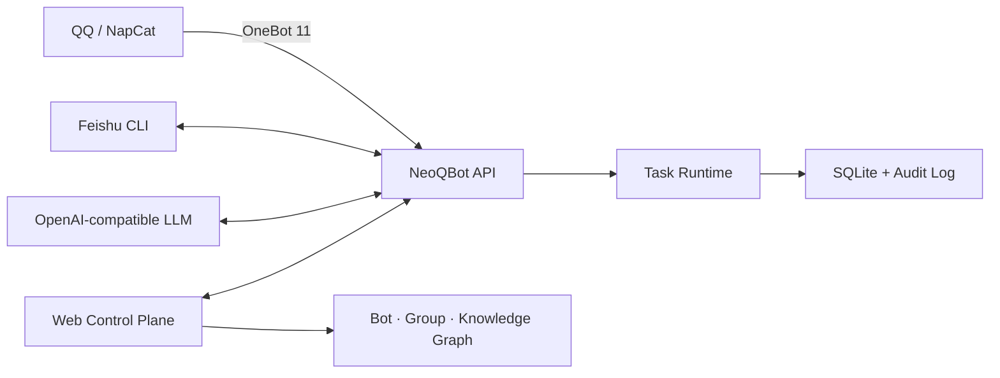

<div align="center">


# NeoQBot

**Bot・グループ・ナレッジリソースのための監査可能なオーケストレーション基盤**

[](https://www.python.org/)
[](LICENSE)
[](https://github.com/LYOfficial/NeoQBot)

[简体中文](README.md) · [English](README.en.md) · 日本語

[クイックスタート](#クイックスタート) · [リソース編成](#リソース編成) · [デプロイ](#docker-デプロイ) · [セキュリティ](#セキュリティ境界) · [ドキュメント](#ドキュメント)

</div>

NeoQBot は、Bot とコミュニティ運営のためのセルフホスト型プラットフォームです。QQ には
OneBot 11、Feishu には設定可能な CLI アダプターを介して接続し、Bot・グループ・ナレッジ
ベースの関係を多対多のビジュアルグラフとして管理します。

本プロジェクトは特定コミュニティ向けの運営ツールとして始まり、現在は汎用的なマルチ
プラットフォーム制御基盤へ発展しています。外部プロトコル、承認・記録・分析・同期処理、
Web 管理画面を分離し、安全に拡張できる構造を採用しています。

> [!IMPORTANT]
> NeoQBot は慎重な運用を既定としています。モデル出力は不可逆な判断ではなく、管理者が確認
> するための根拠として扱ってください。非公式 QQ クライアントやプロトコル実装を接続する前に、
> プラットフォーム規約、アカウントリスク、データ保護要件を確認してください。

## 主な機能

- **ビジュアルリソースグラフ**：QQ Bot、Feishu Bot、QQ グループ、Feishu グループ、ナレッジ
  ベースをノードとして接続します。
- **多対多の管理関係**：1 つの Bot が複数グループを管理し、複数 Bot が同一グループを共同で
  監視・管理できます。
- **細かなタスク設定**：参加申請、記録専用取り込み、分析、対応、公告同期を個別に制御できます。
- **グループワークベンチ**：メッセージ、公告、参加申請、分析結果、管理 Bot をまとめて確認できます。
- **監査可能な制御面**：ジョブ、設定変更、ログイン、競合を SQLite に記録します。
- **安全な設定更新**：シークレットのマスキング、環境変数、リビジョン競合検知、アトミック保存。
- **デスクトップ風 UI**：Windows 11、Codex、VS Code を意識した白黒 UI、テーマ、コマンドパレット。
- **交換可能なアダプター**：OneBot、Feishu CLI、OpenAI-compatible LLM を疎結合に統合します。

## アーキテクチャ



プラットフォーム固有の処理はアダプター境界の内側に保たれます。OneBot 実装、Feishu CLI、
モデルプロバイダーを変更しても、通常は設定またはアダプターの変更だけで対応できます。

## リソース編成

オーケストレーションキャンバスでは次のノードを利用できます。

| ノード | 用途 |
| --- | --- |
| QQ Bot | OneBot / NapCat アカウント、QR ログイン、タスク設定 |
| Feishu Bot | CLI セッション、アーカイブ、検索 |
| QQ グループ | メッセージ、公告、審査、分析、管理関係 |
| Feishu グループ | コラボレーション、通知、ナレッジ連携先 |
| ナレッジベース | ポリシー、運用手順、FAQ、外部知識 |

接続関係は `manages`、`observes`、`archives_to`、`searches`、`syncs` です。グラフは QQ の
管理対象グループに関する正規の設定元となり、保存時に各 Bot の有効設定へ同期されます。詳細は
[オーケストレーションガイド](docs/ORCHESTRATION.md)を参照してください。

## クイックスタート

### 必要環境

- Python 3.11 以上
- [uv](https://docs.astral.sh/uv/) を推奨
- 任意：Docker Compose、NapCatQQ、Feishu CLI、OpenAI-compatible モデルエンドポイント

### ローカル実行

```bash
git clone https://github.com/LYOfficial/NeoQBot.git
cd NeoQBot
uv sync --extra dev
cp config.example.yaml config.yaml
uv run neoqbot init-secrets --secret-dir data/secrets
uv run neoqbot --config config.yaml init-db
uv run neoqbot --config config.yaml serve
```

Windows PowerShell：

```powershell
Copy-Item config.example.yaml config.yaml
uv run neoqbot init-secrets --secret-dir data/secrets
uv run neoqbot --config config.yaml init-db
uv run neoqbot --config config.yaml serve
```

<http://127.0.0.1:8080/gui/> を開きます。初期ユーザー名は `admin` です。ランダムな初期
パスワードは `data/secrets/gui-bootstrap-password` から読み取ります。初回ログイン時に
パスワード変更が必須です。このファイルをリポジトリへコミットしないでください。
管理者は「ユーザー管理」から子ユーザーを作成し、初期パスワードを設定できます。子ユーザーも
初回ログイン時にパスワード変更が必須です。Bot、グループ、ナレッジベース、プラットフォーム設定を
共同管理できますが、他のユーザーの作成、リセット、削除はできません。

## Docker デプロイ

```bash
cp .env.example .env
docker compose build
docker compose up -d
docker compose logs -f neoqbot
docker compose exec neoqbot sh -c 'cat /app/data/secrets/gui-bootstrap-password'
```

最後のコマンドでランダムな初期パスワードを表示します。Compose は既定で管理画面を
`0.0.0.0:6688` に公開するため、サーバー IP からアクセスできます。公開 HTTP は認証情報を平文で
送信するため、ファイアウォールで接続元を制限し、速やかに HTTPS を導入してください。公開アクセスが
不要な場合は `.env` に `NEOQBOT_GUI_BIND_IP=127.0.0.1` を設定します。NapCat の `6099` と OneBot
の `3000` は Compose 内部ネットワークだけで利用し、インターネットへ公開しないでください。

初回起動時、Compose はイメージ内に組み込まれた `config.example.yaml` から永続設定を作成します。
ホストの bind mount を使用しないため、Git ベースの環境やリモート Docker daemon でも未追跡の
`config.yaml` は不要です。環境固有の値は `.env` またはプラットフォーム環境変数で上書きし、
Secret をイメージやリポジトリへ含めないでください。

```bash
docker compose ps
docker compose exec neoqbot neoqbot --config /app/data/config.yaml doctor
curl http://127.0.0.1:6688/healthz
curl http://127.0.0.1:6688/readyz
```

## 設定

[config.example.yaml](config.example.yaml) を `config.yaml` にコピーしてください。環境変数は
`NEOQBOT_` 接頭辞と、ネストを表す二重アンダースコアを使用します。

```bash
NEOQBOT_APP__ADMIN_API_TOKEN=replace-with-a-long-random-token
NEOQBOT_LLM__API_KEY=replace-with-provider-key
```

認証情報には環境変数または読み取り専用 secret ファイルを使用してください。実際の Token、
Cookie、QR コード、データベース、`config.yaml` はコミットしないでください。QQ・Feishu Bot
の認証情報は各 Bot の読み取り専用 secret ファイルに保存してください。NeoQBot は `NEOQBOT_`
接頭辞を使用するアプリケーション設定変数のみを読み取ります。

## CLI

```text
neoqbot --config config.yaml serve
neoqbot --config config.yaml init-db
neoqbot --config config.yaml doctor
neoqbot --config config.yaml show-config
neoqbot --config config.yaml run-moderation
neoqbot --config config.yaml sync-announcements
neoqbot --config config.yaml prune
neoqbot init-secrets
neoqbot init-napcat
```

## セキュリティ境界

- 初期接続確認では `app.dry_run: true` を維持してください。
- 管理 API、OneBot、NapCat WebUI、GUI 初期ログインには別々のランダム Secret を使用し、
  漏えい時は影響する Secret を直ちにローテーションしてください。
- Compose は既定で管理画面を `0.0.0.0:6688` に公開します。公開時はファイアウォールの接続元制限と
  HTTPS が必須です。公開不要なら `NEOQBOT_GUI_BIND_IP=127.0.0.1` を設定してください。NapCat
  WebUI と OneBot は内部専用のまま維持します。
- 信頼できる HTTPS プロキシの背後では `app.require_https: true`、`gui.secure_cookie: true` を設定し、
  `app.allowed_hosts`、`app.forwarded_allow_ips`、`app.management_allowed_networks` を正確に指定します。
- `app.forwarded_allow_ips` に `*` を指定しないでください。偽装されたプロキシヘッダーにより、
  接続元アドレス制御が回避される可能性があります。
- OpenAPI は既定で無効であり、高リスクな接続・Secret 設定は GUI から変更できません。
- NeoQBot は QQ パスワードを保存しません。QR コードは関連する NapCat が生成します。
- 自動承認、拒否、通知、アカウント操作は最小権限・少数グループから段階的に導入してください。
- SQLite、メッセージアーカイブ、Feishu と NapCat のセッションを保護・バックアップしてください。
- 詳細な強化チェックリスト、プロキシ要件、漏えい時の対応は [SECURITY.md](SECURITY.md) を参照してください。

## リポジトリ構成

```text
src/neoqbot/                         NeoQBot Python パッケージ・CLI エントリ
  adapters/                          QQ・Feishu・LLM アダプター
  web/                               管理画面
  app.py                             FastAPI アプリケーション
  config.py                          設定・検証・編成モデル
  database.py                        SQLite・監査レイヤー
  services.py                        参加申請・分析・公告処理
  runtime.py                         スケジューリングとライフサイクル
integrations/astrbot_plugin_neoqbot_control/
assets/branding/                      Logo 原画像・SVG・ブランド説明
docs/                                設計・連携ドキュメント
```

プロジェクト名、Python パッケージ、配布物、CLI、サービス、環境変数名前空間はすべて NeoQBot です。

## 開発

```bash
uv sync --extra dev
uv run ruff check .
uv run ruff format --check src
node --check src/neoqbot/web/app.js
```

変更には関連するドキュメントを含めてください。本リポジトリには GitHub Actions を同梱していないため、
マージ前に管理された環境で上記チェックを実行してください。

## ドキュメント

- [アーキテクチャとワークフロー](docs/ARCHITECTURE.md)
- [リソース編成](docs/ORCHESTRATION.md)
- [Feishu CLI 連携](docs/FEISHU_CLI.md)
- [ブランド素材](assets/branding/README.md)
- [セキュリティポリシーとデプロイチェックリスト](SECURITY.md)
- [简体中文 README](README.md)
- [English README](README.en.md)

## コントリビューション

不具合、アダプター要望、設計提案は [Issues](https://github.com/LYOfficial/NeoQBot/issues) へ投稿して
ください。Pull Request も歓迎します。書き込み操作やセキュリティ境界に関わる変更では、
リスクと検証方法を説明してください。

## ライセンス

NeoQBot は [GNU General Public License v3.0](LICENSE) の下で公開されています。
