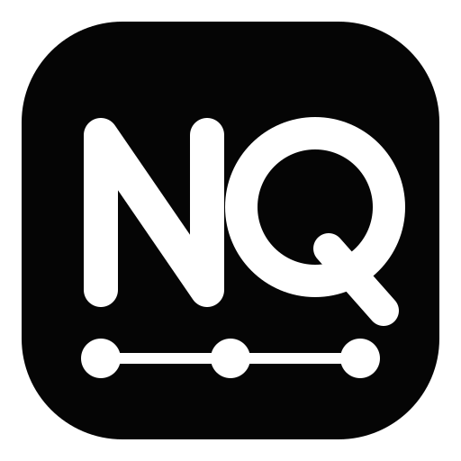
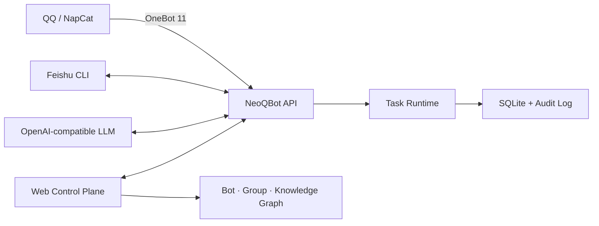

<div align="center">



# NeoQBot

**面向多机器人、多群组与知识资源的可审计编排控制面**

[](https://www.python.org/)
[](LICENSE)
[](https://github.com/LYOfficial/NeoQBot)

简体中文 · [English](README.en.md) · [日本語](README.ja.md)

[快速开始](#快速开始) · [资源编排](#资源编排) · [部署](#docker-部署) · [安全](#安全边界) · [文档](#文档)

</div>

NeoQBot 是一个自托管的机器人与群组运营平台。它通过 OneBot 11 接入 QQ，通过可配置 CLI
接入飞书，并用可视化网络统一表达 Bot、群组和知识库之间的管理、观察、归档、搜索与同步关系。

项目最初服务于特定社区的群治理需求，现在已发展为通用的多平台控制面：连接层负责平台协议，
事务层负责审批、记录、分析和同步，管理端负责配置、审计和资源编排。

> [!IMPORTANT]
> NeoQBot 默认采用审慎策略：模型输出只作为管理线索，高风险操作应保留人工确认。接入非官方
> QQ 客户端或协议实现前，请自行评估平台条款、账号风控与数据合规要求。

## 核心能力

- **网状资源编排**：以类似节点编辑器的方式连接多个 QQ Bot、飞书 Bot、QQ群、飞书群和知识库。
- **多账号与多群协作**：一个 Bot 可管理多个群，多个 Bot 也可共同观察或管理同一群。
- **群级事务分工**：在每条 Bot→群连接上分别启用入群管理、纯记录、消息分析、风险处理和公告同步。
- **群组工作台**：集中查看群消息、公告、入群请求、分析记录以及当前管理关系。
- **可审计控制面**：所有关键任务、配置更新、登录和冲突均写入 SQLite 审计记录。
- **安全配置保存**：敏感字段遮罩、环境变量注入、配置版本冲突检测和原子写入。
- **桌面式管理界面**：Win11 / Codex / VS Code 风格的深浅色工作台、命令面板与响应式布局。
- **可替换适配器**：OneBot、飞书 CLI 和 OpenAI-compatible LLM 均隔离在端口与适配器层。

## 架构概览



运行时不会把平台实现细节扩散到业务服务中。更换 OneBot 实现、飞书命令行工具或模型供应商时，
通常只需要调整连接配置或替换适配器。

## 资源编排

资源编排是 NeoQBot 的核心入口。画布支持以下节点：

| 节点 | 用途 |
| --- | --- |
| QQ Bot | OneBot / NapCat 账号、二维码登录和连接参数 |
| 飞书 Bot | CLI 登录态、归档和搜索能力 |
| QQ群 | 消息、公告、审核、分析，以及各 Bot 在本群的事务分工 |
| 飞书群 | 协作、通知与知识流转目标 |
| 知识库 | 政策、手册、问答或外部知识资源 |

连接关系包括 `manages`、`observes`、`archives_to`、`searches` 和 `syncs`。编排配置是 QQ
群归属和事务分工的唯一权威来源；`manages` / `observes` 边上的 `tasks` 表示“这个 Bot 在这个群
承担哪些事务”，因此同一 Bot 在不同群可以使用不同的开关、周期、阈值和公告目标。

QQ/飞书 Bot 的新增、删除、账号连接和登录也只在资源编排完成。选择节点可在右侧查看摘要与
群级分工，点击“详细配置”或右键节点会在当前页面打开中心弹窗；系统设置只包含模型、共享策略、
存储和系统安全。已有 Bot 的内部 ID 不可修改，显示名称可随时调整，从而保持 Webhook、Secret
路径和登录身份连续。未与当前 Bot 建立有效连接的群事件会在 Webhook 入口直接丢弃。

完整说明见 [资源编排指南](docs/ORCHESTRATION.md)。

## 快速开始

### 环境要求

- Python 3.11 或更高版本
- 推荐使用 [uv](https://docs.astral.sh/uv/)
- 可选：Docker Compose、NapCatQQ、飞书 CLI、OpenAI-compatible 模型端点

### 本地运行

```bash
git clone https://github.com/LYOfficial/NeoQBot.git
cd NeoQBot
uv sync --extra dev
cp config.example.yaml config.yaml
uv run neoqbot init-secrets --secret-dir data/secrets
uv run neoqbot --config config.yaml init-db
uv run neoqbot --config config.yaml serve
```

Windows PowerShell 可使用：

```powershell
Copy-Item config.example.yaml config.yaml
uv run neoqbot init-secrets --secret-dir data/secrets
uv run neoqbot --config config.yaml init-db
uv run neoqbot --config config.yaml serve
```

打开 <http://127.0.0.1:8080/gui/>。初始账号为 `admin`，密码从
`data/secrets/gui-bootstrap-password` 读取；首次登录必须修改密码。请勿把该文件提交到仓库。
管理员可在“用户管理”中创建子用户并设置初始密码。子用户首次登录后同样必须修改密码，可以共同
管理 Bot、群、知识库和平台设置，但不能创建、重置或删除其他用户。

## Docker 部署

```bash
cp .env.example .env
docker compose build
docker compose up -d
docker compose logs -f neoqbot
docker compose exec neoqbot sh -c 'cat /app/data/secrets/gui-bootstrap-password'
```

最后一条命令输出随机初始密码。Compose 默认将管理端发布到 `0.0.0.0:6688`，可通过服务器 IP
访问。公网裸 HTTP 会明文传输登录凭据，必须先限制防火墙来源并尽快接入 HTTPS；不需要公网访问时，
在 `.env` 设置 `NEOQBOT_GUI_BIND_IP=127.0.0.1`。Compose 同时准备持久化数据、NapCat 配置、QQ
登录态、二维码缓存和飞书用户目录。NapCat 的 `6099` 和 OneBot 的 `3000` 默认仅存在于 Compose
内部网络，不要把它们额外映射到公网。

Compose 自带的 `qq-bridge` 只承载一个真实 QQ 账号。资源编排中首个兼容旧配置的 QQ Bot 会
自动使用“内置 NapCat”模式并复用初始化服务生成的 Secret 与登录态；新增的其他 QQ Bot 必须
选择“外部 OneBot / NapCat”，并指向各自独立的实例。NapCat 统一上报到
`/webhooks/onebot`，不再依赖固定的 `default` Bot ID。

Compose 首次启动使用镜像内置的 `config.example.yaml` 创建持久化配置，不依赖宿主机 bind mount，
适用于 GitHub 拉取式部署和远程 Docker daemon。部署差异优先通过 `.env` 或平台环境变量覆盖；
Secret 不应写入镜像或仓库。

常用检查：

```bash
docker compose ps
docker compose exec neoqbot neoqbot --config /app/data/config.yaml doctor
curl http://127.0.0.1:6688/healthz
curl http://127.0.0.1:6688/readyz
```

## 配置

主配置文件为 `config.yaml`，完整字段见 [config.example.yaml](config.example.yaml)。环境变量使用
`NEOQBOT_` 前缀和双下划线表示嵌套字段：

```bash
NEOQBOT_APP__ADMIN_API_TOKEN=replace-with-a-long-random-token
NEOQBOT_LLM__API_KEY=replace-with-provider-key
```

敏感值优先使用环境变量或只读 secret 文件，不要提交真实 Token、Cookie、二维码、数据库或
`config.yaml`。QQ 与飞书 Bot 的凭据应配置在各 Bot 的只读 secret 文件中。NeoQBot 仅读取
`NEOQBOT_` 前缀的应用配置变量。

## 命令行

```text
neoqbot --config config.yaml serve
neoqbot --config config.yaml init-db
neoqbot --config config.yaml doctor
neoqbot --config config.yaml show-config
neoqbot --config config.yaml run-moderation
neoqbot --config config.yaml sync-announcements
neoqbot --config config.yaml prune
neoqbot init-secrets
neoqbot init-napcat
```

## 安全边界

- 首次联调保持 `app.dry_run: true`，确认连接、鉴权和审计链路后再启用写操作。
- 管理 API、OneBot、NapCat WebUI 和 GUI 初始密码使用独立随机 Secret；泄露后立即全部轮换。
- Compose 默认发布管理端 `0.0.0.0:6688`；公网部署必须使用防火墙来源限制和 HTTPS。不需要公网
  访问时设置 `NEOQBOT_GUI_BIND_IP=127.0.0.1`。NapCat WebUI 和 OneBot 仍仅在内部网络开放。
- 生产环境必须在可信 HTTPS 反向代理后设置 `app.require_https: true`、`gui.secure_cookie: true`，
  并准确配置 `app.allowed_hosts`、`app.forwarded_allow_ips` 和 `app.management_allowed_networks`。
- 不要把 `app.forwarded_allow_ips` 设置为 `*`；伪造代理头可能绕过基于来源地址的访问控制。
- OpenAPI 文档默认关闭，管理端高风险连接与 Secret 设置默认禁止通过 GUI 修改。
- NeoQBot 不保存 QQ 密码；二维码由对应 NapCat 实例产生并通过受保护接口展示。
- 自动审批、拒绝、通知和其他账号操作应从最小权限、少量群组开始灰度。
- SQLite、消息归档、飞书登录态和 NapCat 登录态都应纳入加密备份与访问控制。
- 完整的加固清单、反向代理要求和泄露处置流程见 [安全策略](SECURITY.md)。

## 项目结构

```text
src/neoqbot/                         NeoQBot Python 包与 CLI 入口
  adapters/                          QQ、飞书与 LLM 适配器
  web/                               管理端静态资源
  app.py                             FastAPI 应用与管理 API
  config.py                          配置、校验与编排模型
  database.py                        SQLite 数据与审计层
  services.py                        入群、消息分析与公告事务
  runtime.py                         调度、队列和生命周期
integrations/astrbot_plugin_neoqbot_control/
assets/branding/                      Logo 原图、SVG 与品牌说明
docs/                                架构、编排和飞书 CLI 文档
```

项目名称、Python 包、CLI、服务名与环境变量均统一为 NeoQBot。

## 开发

```bash
uv sync --extra dev
uv run ruff check .
uv run ruff format --check src
uv run python -m unittest discover -s tests -v
node --check src/neoqbot/web/app.js
```

提交变更时请同步更新相关文档。仓库不内置 GitHub Actions，维护者应在合并前于受控环境运行上述检查。

## 文档

- [架构与工作流](docs/ARCHITECTURE.md)
- [资源编排指南](docs/ORCHESTRATION.md)
- [飞书 CLI 集成](docs/FEISHU_CLI.md)
- [品牌资源](assets/branding/README.md)
- [安全策略与部署清单](SECURITY.md)
- [English README](README.en.md)
- [日本語 README](README.ja.md)

## 参与贡献

欢迎通过 [Issues](https://github.com/LYOfficial/NeoQBot/issues) 提交缺陷、适配器需求和设计提案，
也欢迎直接提交 Pull Request。涉及平台写操作或安全边界的变更，请在说明中包含风险和验证方式。

## 许可证

NeoQBot 基于 [GNU General Public License v3.0](LICENSE) 发布。
