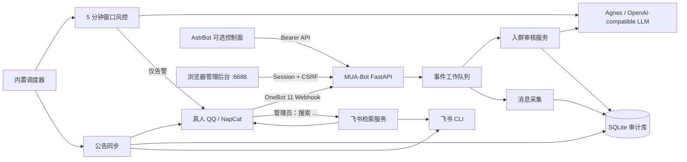

# MUA-Bot

MUA-Bot 是一个面向 Ubuntu/Debian 部署的跨平台群治理 Agent。它通过 OneBot 11 接入真人
QQ 客户端，通过可配置的飞书 CLI 接口归档和检索云文档，并使用 Agnes AI 或任意
OpenAI-compatible 模型进行结构化审核。

当前仓库已经包含可运行的首版核心，而不是只有设计稿：

- QQ 入群申请接收、幂等落库、模型审核、可控自动同意和人工复核通知；
- QQ 群消息持续采集，每 30 分钟分析此前 5 分钟窗口，命中风险时私聊管理员；
- QQ 群公告全量获取、本地版本化归档、失败重试和飞书同步；
- 管理员 QQ 私聊 `搜索 关键词`，调用飞书 CLI 检索并将结果回复 QQ；
- SQLite 审计记录、健康检查、管理 API、CLI、AstrBot 控制插件；
- 默认 30 天消息保留策略与每日自动清理（公告版本不自动删除）；
- 内置中文管理 GUI：平台登录、配置热加载、任务执行与审计浏览；
- Windows 开发支持、Linux Dockerfile 和 docker-compose。

首次启动默认 `dry_run: true`、`auto_approve: false`、`auto_reject: false`。在真实群验证前，
MUA-Bot 不会批准/拒绝申请，也不会真正向 QQ 发送消息。

## 架构



核心业务不依赖具体 QQ 或飞书客户端。QQ 被限制在 OneBot 适配器内，飞书命令被限制在
不经过 shell 的 argv 模板内，因此外部工具升级时不必重写审核、风控和归档逻辑。

更完整的组件、状态机和迭代计划见 [架构文档](docs/ARCHITECTURE.md)。

## 重要边界

1. NapCat、LLOneBot 等真人 QQ 接入属于非官方协议方案，可能违反平台条款、触发风控或
   封号。请自行确认合规性，使用专用低权限账号，并保留人工接管能力。
2. MUA-Bot 不自动禁言、踢人或处罚群成员。模型只生成风险线索，最终由管理员结合上下文
   处理，以减少误伤。
3. 飞书 CLI 的命令面仍在快速演进。MUA-Bot 不猜测某个版本的子命令，而是提供安全的
   argv 模板契约；安装当前官方版本后根据 `feishu --help` 配置一次即可。
4. 群消息、申请内容和公告会进入本地 SQLite。部署者必须取得必要授权，限制数据库文件
   权限，并制定保留、备份和删除策略。
5. 通用执行代理（Codex、Claude Code 等）不直接接收群成员原文并执行命令。群消息可能
   包含提示词注入，热路径只允许返回经过 Pydantic 校验的结构化模型结果。
6. GUI 初始账号为 `admin`、密码为 `muaadmin`，首次登录会被强制要求修改。生产环境仍应
   配置 HTTPS、限制 6688/6099 端口来源，并为 NapCat WebUI 设置独立强密码。

## 目录

```text
src/mua_bot/
  adapters/             OneBot、LLM、飞书 CLI 适配器
  app.py                 FastAPI Webhook 和管理 API
  auth.py / gui.py       GUI 认证、会话、配置热加载与管理 API
  web/                   内置中文前端页面、样式和交互
  cli.py                 serve/doctor/手动任务命令
  config.py              YAML + MUA_* 环境变量配置
  database.py            SQLite schema 和审计仓储
  events.py              OneBot 事件标准化与路由
  runtime.py             工作队列和周期调度
  services.py            审批、风控、公告、搜索用例
integrations/
  astrbot_plugin_mua_control/  可选 AstrBot 管理插件
tests/                   核心幂等、风控、配置与签名测试
```

## Windows 本地开发

要求 Python 3.11+。PowerShell：

```powershell
Copy-Item config.example.yaml config.yaml
Copy-Item .env.example .env
py -3.12 -m venv .venv
.\.venv\Scripts\Activate.ps1
python -m pip install -e ".[dev]"
mua-bot --config config.yaml init-db
mua-bot --config config.yaml show-config
mua-bot --config config.yaml serve
```

服务启动后：

- `GET http://127.0.0.1:8080/healthz`：进程健康；
- `GET http://127.0.0.1:8080/readyz`：数据库就绪；
- `POST http://127.0.0.1:8080/webhooks/onebot`：OneBot 反向 HTTP 事件；
- `GET http://127.0.0.1:8080/docs`：OpenAPI 页面。
- `GET http://127.0.0.1:8080/gui/`：本地管理 GUI。

所有 YAML 字段都可由嵌套环境变量覆盖，例如：

```powershell
$env:MUA_APP__DRY_RUN = "false"
$env:MUA_LLM__API_KEY = "..."
$env:MUA_QQ__MANAGED_GROUP_IDS = '["123456789"]'
```

## QQ / OneBot 配置

推荐让真人 QQ 客户端侧车（例如 NapCatQQ）只负责登录和 OneBot 协议，MUA-Bot 不保存 QQ
密码。

在 OneBot 端完成以下设置：

1. 启用 HTTP API，例如 `0.0.0.0:3000`，配置 access token；
2. 启用反向 HTTP/Webhook，地址为
   `http://mua-bot:8080/webhooks/onebot`（同一 Compose 网络）或开发机对应地址；
3. 如实现支持事件 secret/HMAC-SHA1，设置与 `qq.webhook_secret` 相同的值；
4. 确认实现支持 `set_group_add_request`、`send_private_msg`、`get_login_info`；
5. 公告属于扩展 API。MUA-Bot 会依次尝试 `qq.announcement_actions` 中的动作名，请按所用
   OneBot 实现的当前文档调整。

Docker 部署时可直接在 GUI 的“平台登录”页面打开 NapCat WebUI，通过 6099 端口扫码登录。
如果 NapCat 禁止 iframe 嵌入，点击“新窗口打开”即可。

先保持 `app.dry_run: true`，执行：

```powershell
mua-bot --config config.yaml doctor
mua-bot --config config.yaml sync-announcements
mua-bot --config config.yaml run-moderation
```

数据库和日志符合预期后，再设置 `dry_run: false`。自动审批还需要单独将
`join_approval.auto_approve` 改为 `true`；自动拒绝默认建议长期关闭。

## Agnes AI / 大模型

只要 Agnes AI 提供 OpenAI-compatible `/v1/chat/completions` 接口，即可配置：

```yaml
llm:
  driver: openai_compatible
  base_url: https://your-agnes-endpoint.example/v1
  model: your-agnes-model
```

密钥使用环境变量 `MUA_LLM__API_KEY`。模型必须支持 JSON object 输出。审核响应会再次经过
严格 schema 校验；请求失败、JSON 无效或置信度不足时，入群申请自动降级到人工审核。
如果 Agnes 兼容接口不接受 OpenAI 的 `response_format` 参数，可设置
`llm.json_response_format: false`，MUA-Bot 仍会从文本中提取并校验 JSON。

`llm.driver: rules` 只用于离线联调。它无法理解上下文，不应作为正式内容治理模型。

## 飞书 CLI

从[飞书 CLI 官方页面](https://www.feishu.cn/feishu-cli)安装并登录真人飞书账号。由于 CLI
的包名和子命令会随发布版本变化，先运行：

```bash
feishu --version
feishu --help
```

然后在 `feishu.command_templates` 中配置两个动作：

- `archive_announcement`：向目标电子表格/多维表格新增记录；可使用
  `{payload_json}`、`{group_id}`、`{announcement_id}`、`{title}`、`{content}`、
  `{author_id}`、`{published_at}`；
- `search`：搜索云文档；可使用 `{query}` 和 `{limit}`，标准输出必须为 JSON 数组，或
  带 `items`/`data`/`results` 数组的 JSON 对象。

要在 GUI 中完成人类账号授权，再配置 `login`、`logout` 和可选 `doctor` 模板。GUI 会执行
这些命令，并展示 CLI 返回的授权链接、二维码文本或状态 JSON。

模板中的每一项都是一个独立 argv，程序使用 `create_subprocess_exec` 直接执行，不经过
PowerShell/Bash。完整契约和包装器建议见 [飞书 CLI 接口说明](docs/FEISHU_CLI.md)。

配置完成后设置：

```yaml
feishu:
  enabled: true
  driver: cli
  executable: feishu
```

公告先保存到 SQLite，再同步飞书。飞书不可用时记录保持 `failed`，下一轮自动重试，不会
丢失本地档案。

## Ubuntu / Debian Docker 部署

```bash
cp .env.example .env
mkdir -p data
sudo chown -R 10001:10001 data
chmod 700 data
# 编辑端口等部署参数；密钥和业务配置可直接在 GUI 中完成
docker compose build
docker compose --profile napcat up -d
docker compose logs -f mua-bot
```

启动后访问：

- `http://服务器IP:6688/gui/`：MUA-Bot 管理后台；
- 初始管理员：`admin` / `muaadmin`，首次登录强制修改密码；
- `http://服务器IP:6099/`：NapCat WebUI，也可从 GUI 的“平台登录”打开；
- 配置自动写入并持久化到 `data/config.yaml`；
- OneBot Webhook 在 Compose 内仍使用 `http://mua-bot:8080/webhooks/onebot`。

6688 和 6099 默认监听所有网卡，便于首次远程部署。生产环境应使用云防火墙限制来源，或在
`.env` 中把 `MUA_GUI_BIND_IP`、`NAPCAT_WEBUI_BIND_IP` 改为 `127.0.0.1` 后通过 SSH 隧道或
HTTPS 反向代理访问。不同 NapCat 镜像版本的卷路径和环境变量可能变化，升级前必须核对其
官方说明并备份 `data/napcat`、`data/qq`。

Docker 镜像默认不安装飞书 CLI。若官方 CLI 以 npm 包发布，可在 `.env` 中填写当前包名：

```dotenv
INSTALL_FEISHU_CLI=true
FEISHU_CLI_PACKAGE=官方页面给出的包名
```

如果 CLI 不是 npm 包，请按官方方式构建派生镜像，或把可执行文件和登录态以只读/最小
权限卷挂载进容器。不要把登录 cookie、token 或 `.env` 提交到 Git。

## AstrBot 控制面

将 `integrations/astrbot_plugin_mua_control` 复制到 AstrBot 的
`data/plugins/astrbot_plugin_mua_control`，配置：

```dotenv
MUA_API_URL=http://mua-bot:8080
MUA_API_TOKEN=与 MUA_APP__ADMIN_API_TOKEN 相同
MUA_ASTRBOT_ADMIN_IDS=管理员QQ号1,管理员QQ号2
```

插件提供 `/mua_status`、`/mua_moderate`、`/mua_sync`。只有显式管理员 ID 能调用。AstrBot
可以继续承载对话、知识库或 Agent Plan；高风险的审批执行仍由 MUA-Bot 的策略阈值、审计
和幂等状态机控制。

## 管理 API 与运维

管理 API 必须配置 `app.admin_api_token`，并使用：

```bash
curl -H "Authorization: Bearer $TOKEN" http://127.0.0.1:8080/api/v1/status
curl -X POST -H "Authorization: Bearer $TOKEN" \
  http://127.0.0.1:8080/api/v1/jobs/moderation
curl -X POST -H "Authorization: Bearer $TOKEN" \
  http://127.0.0.1:8080/api/v1/jobs/announcements
curl -X POST -H "Authorization: Bearer $TOKEN" \
  http://127.0.0.1:8080/api/v1/jobs/maintenance
```

Docker 宿主机上将示例地址的 `8080` 替换为 `6688`。GUI 使用独立的管理员会话、HttpOnly
Cookie 和 CSRF 校验，不依赖管理 API Token。

SQLite 默认位于 `data/mua-bot.db`。备份时同时保留主文件以及可能存在的 `-wal`、`-shm`
文件，或在停止服务后复制。生产环境建议用宿主机备份任务定期快照整个 `data` 目录。
`retention` 配置会每日删除过期消息、申请、风控运行和审计日志；公告版本永久保留，除非
管理员另行制定归档删除流程。

## 测试

```bash
ruff check .
ruff format --check .
pytest
docker compose config
```

## 上线清单

- [ ] OneBot 和飞书均使用专用低权限账号；
- [ ] Webhook secret、OneBot token、管理 API token 均已设置且不同；
- [ ] `doctor` 全部通过，公告可本地归档并可写入飞书；
- [ ] 至少观察一周 `dry_run` 审核结果并人工抽样；
- [ ] 入群政策与群规由管理员书面确认；
- [ ] 只开启 `auto_approve`，保留拒绝和处罚为人工动作；
- [ ] 数据目录权限、备份、保留期限和事故响应流程已经配置；
- [ ] 非官方 QQ 客户端升级前有回滚方案。

本项目采用 GPL-3.0-or-later，详见 [LICENSE](LICENSE)。
