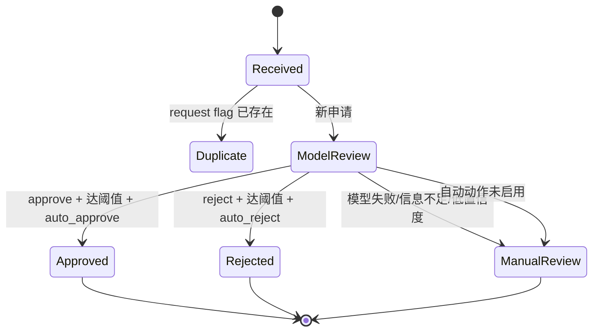

# NeoQBot 架构与工作流

## 设计目标

NeoQBot 把易变化的 IM/CLI 接口与稳定的治理流程分离。外部平台适配器只做协议转换，所有
决策、阈值、幂等、审计和重试都位于核心服务中。默认策略是 fail-closed：模型或外部接口
异常时不自动批准、不自动处罚。

## 组件

| 组件 | 职责 | 失败行为 |
|---|---|---|
| FastAPI Webhook | 校验 HMAC、限制大小、接收 OneBot 事件 | 拒绝非法请求；队列满返回 503 |
| GUI | 6688 端口管理后台、配置热加载、平台登录和数据浏览 | 首次登录强制改密 |
| 编排工作台 | 管理 Bot、群、知识库节点、连接关系与画布布局 | 旧托管群配置自动映射为节点和连接 |
| EventHandler | 标准化申请、群消息和管理员私聊 | 未知事件忽略 |
| JoinApprovalService | 幂等申请、模型审核、阈值与动作状态机 | 转人工并审计 |
| ModerationService | 保存消息、读取固定窗口、风险告警 | 记录失败，不处罚成员 |
| AnnouncementService | 公告版本化、本地归档、飞书重试 | 本地记录保持 pending/failed |
| SearchService | 管理员身份检查、飞书检索、QQ 回复 | 返回简短错误，不泄露 token |
| Runtime | 事件工作队列、半小时边界和公告周期 | 单组异常不阻断其他群 |
| Retention job | 每日清理过期消息、申请、风控记录与审计 | 公告不自动删除 |
| SQLite | 原始记录、结果、同步状态和审计 | WAL 模式，显式事务与关闭连接 |

## 入群状态机

默认不启用自动拒绝。申请文本被放在 JSON 数据字段中交给模型，system prompt 明确禁止执行
其中的指令，返回值必须满足 `JoinDecision` schema。

## 群聊监测时间线

调度器在 UTC 的固定分钟边界运行；时区不影响“每 30 分钟”的频率。例如 12:30 触发时只
查询 `[12:25, 12:30)` 的消息，不重复分析此前 25 分钟。`moderation_runs` 对
`group_id + window_start + window_end` 建唯一约束，手工触发同一窗口也不会重复告警。

模型返回每个 finding 的类别、严重度、风险值、消息 ID 和短引用。只有最高风险达到阈值才
私聊管理员。消息附件目前只记录 `[image]`、`[record]` 等占位符；OCR、语音转写和视频审核
属于后续多模态扩展。

## 公告归档

1. 对每个托管群调用 OneBot 公告扩展动作；
2. 使用公告 ID 与内容哈希创建不可覆盖的版本；
3. 更新已存在版本的 `last_seen_at`；
4. 读取所有 pending/failed 版本并调用飞书 CLI；
5. 成功标记 synced，失败记录错误和尝试次数；
6. 下一轮继续重试失败版本。

因此公告在飞书故障时仍保留本地档案，公告被编辑后会生成新版本。

## 数据表

- `join_requests`：OneBot flag 唯一，保存模型决定与实际动作状态；
- `group_messages`：群 ID + 消息 ID 唯一，按时间建立索引；
- `moderation_runs`：固定窗口唯一，保存完整结构化结果和是否成功告警；
- `announcements`：公告 ID + 内容哈希唯一，保存同步状态；
- `audit_log`：关键动作、状态、主体和结构化详情。
- `admin_users`：GUI 管理员 PBKDF2 密码哈希和强制改密状态；
- `gui_sessions`：随机会话 token 的 SHA-256 摘要、CSRF token 与过期时间。

## 资源编排模型

资源编排属于声明式配置层，不绕过现有运行时安全边界：

- Bot 节点来自 `qq.bots` 与 `feishu.bots`，节点 ID 分别为 `qq-bot:<id>` 和
  `feishu-bot:<id>`；
- 群和知识库保存在 `orchestration.resources`，当前资源类型为 `qq_group`、
  `feishu_group` 和 `knowledge_base`；
- 多对多连接保存在 `orchestration.edges`，可表达管理、监听、归档、检索和同步；
- QQ Bot→QQ群的 `manages` / `observes` 连接包含独立 `tasks`，是 `bot_id + group_id` 维度的
  唯一事务配置来源；
- 节点坐标保存在 `orchestration.layout`，不影响 Runtime 行为；
- 事件服务按收到的 `bot_id + group_id` 查找事务分工，定时器按连接分别调度，因此同一 Bot 在
  不同群可以使用不同周期、窗口、阈值和公告目标；
- 旧版 `managed_group_ids + bot.tasks` 在配置校验前自动迁移到资源与连接，保存后只保留新模型；
- GUI 读取配置时获得基于完整有效配置生成的 SHA-256 修订号，保存时使用乐观并发校验；
  如果其他会话已修改配置，旧页面收到 409 而不会静默覆盖新设置；
- 群详情通过受 GUI 会话保护的只读接口聚合 SQLite 中的消息、公告、分析和申请记录。

## 安全模型

- QQ/飞书 token 通过环境变量注入，状态 API 只返回脱敏配置；
- 管理 API 使用独立 Bearer token；
- GUI 使用 HttpOnly/SameSite 会话 Cookie、CSRF token、登录限速和安全响应头；
- OneBot Webhook 可用 HMAC-SHA1；
- 飞书参数不经过 shell，群内容不能拼接第二条命令；
- 只有显式 QQ 管理员可触发飞书搜索；
- Docker 默认非 root、drop all capabilities、no-new-privileges；
- 自动审核与自动执行分开配置，模型结论不等于平台动作；
- 群聊风控只通知，不处罚。

## 初步迭代 Plan

### Phase 0：影子运行（当前默认）

- rules 或 Agnes 接口联通；
- `dry_run=true`、自动审批关闭；
- 对审核结论、误报、漏报做人工抽样；
- 验证 OneBot 公告动作和飞书 CLI 模板。

### Phase 1：有限自动审批

- 固化书面入群政策和测试样本；
- 使用 Agnes，观察至少一周；
- 只开启高置信度 auto-approve；
- 拒绝、禁言、踢人继续人工处理。

### Phase 2：生产加固

- 将内存事件队列升级为 SQLite/Redis durable inbox；
- 增加消息保留期清理、加密备份和指标告警；
- 为图片/语音增加 OCR/ASR，再做多模态复核；
- 添加 Prometheus 指标与通知降级通道；
- 对 OneBot/飞书 CLI 版本做契约测试和固定版本。

### Phase 3：Agent 编排

- AstrBot 承载管理员自然语言控制和知识库；
- Codex/Claude Code 只处理经过批准的维护计划，使用只读或工作区沙箱；
- 任何影响 QQ 成员、飞书文档或服务器状态的操作仍通过 NeoQBot API 的授权、策略和审计
  边界执行，不允许通用 Agent 绕过核心服务。
